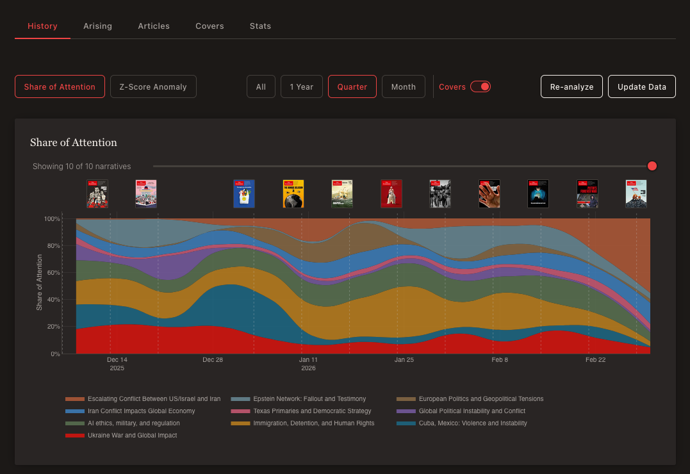
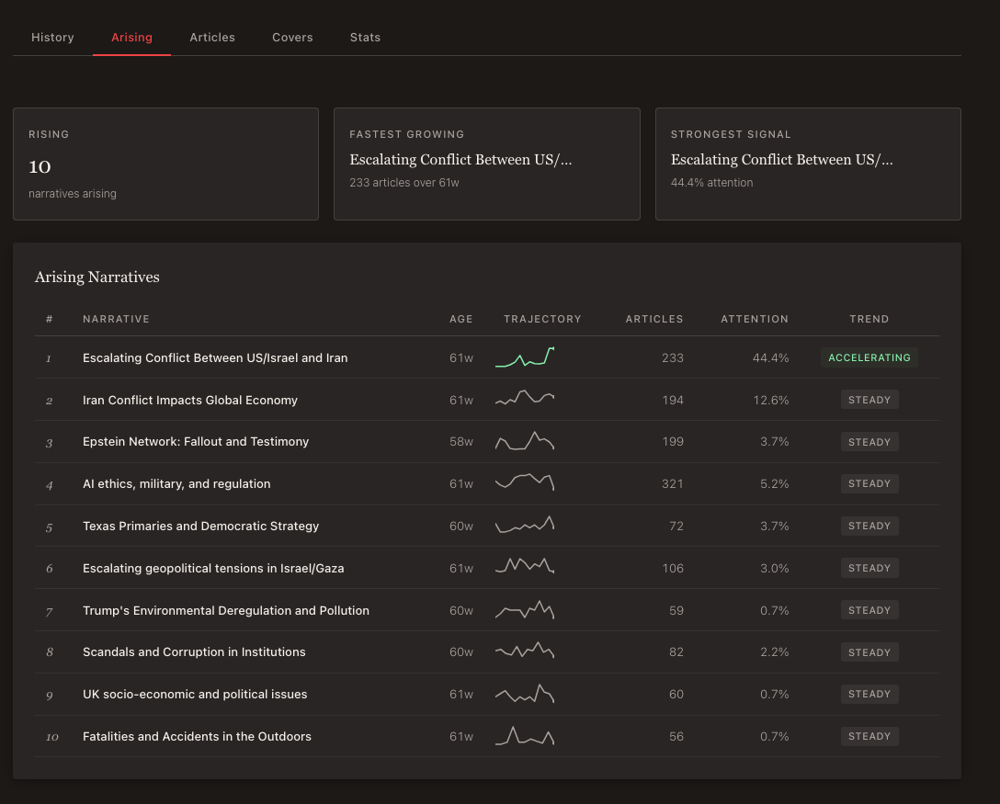
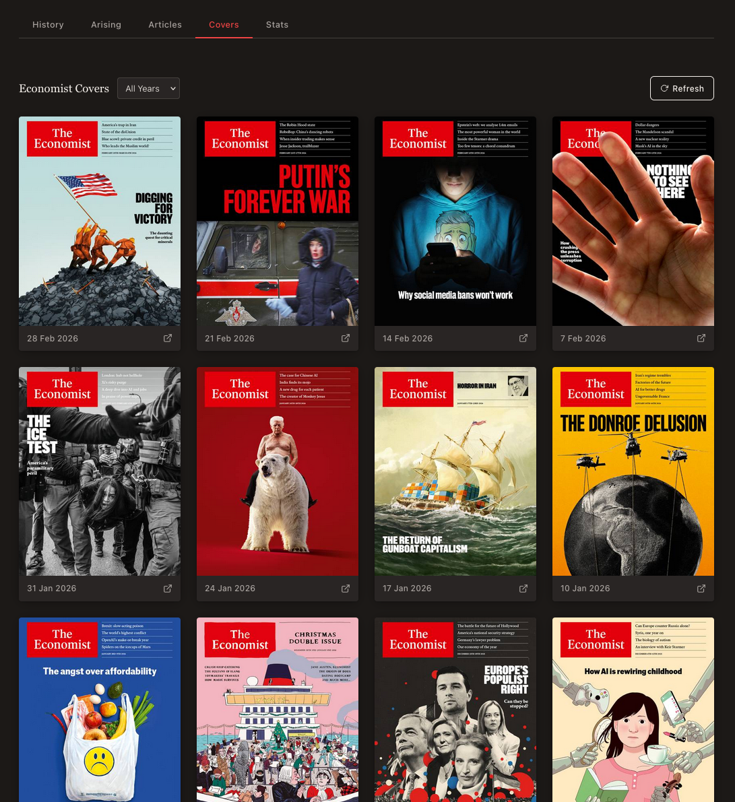
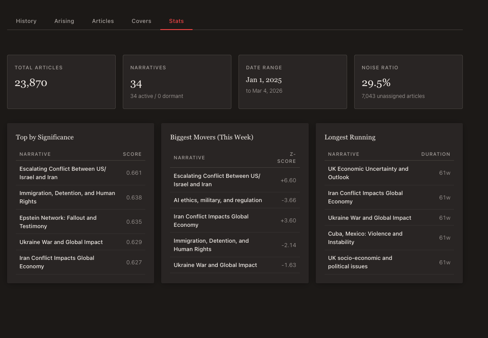

# Narratio — What Stories Are Markets Telling Themselves?

> Built by a vibecoder who doesn't fully know what he's doing. If something looks off, it probably is. Issues, PRs, and unsolicited advice are all genuinely welcome.

Narratio is a financial narrative tracker. It ingests headlines from the New York Times and The Guardian, figures out which macro stories are dominating market attention (think "Fed pivot", "AI bubble", "soft landing"), and tracks how they rise, peak, and fade over time. It's like a radar for the stories that move money — except built by someone who mostly just vibes until things work.

## Use Cases

- **Macro investors**: See which narratives are overextended or just emerging before consensus catches up
- **Market watchers**: Track how the media narrative around a theme shifts week to week
- **Contrarian thinkers**: Spot when everyone is talking about the same thing (that's usually when it stops working)
- **Curious people**: Honestly it's just interesting to see what the financial press obsesses over

## Quick Start

You'll need Python 3.12+, Node.js 18+, and three API keys:
- [NYT Archive API](https://developer.nytimes.com/)
- [Guardian Open Platform](https://open-platform.theguardian.com/)
- [OpenRouter](https://openrouter.ai/) (for embeddings + LLM calls)

```bash
# Clone and install
git clone https://github.com/icon3333/narratio.git
cd narratio
uv sync
cd frontend && npm install && cd ..

# Configure your API keys
cp .env.example .env
# Edit .env — you need NYT_API_KEY, GUARDIAN_API_KEY, OPENROUTER_API_KEY

# Run the full pipeline (ingests current month + analyzes)
uv run narratio

# Start the backend API (port 8000)
uv run uvicorn narratio.api:app --reload

# In another terminal — start the frontend (port 3000)
cd frontend && npm run dev
```

Open **http://localhost:3000** and you should see the dashboard.

**Pro tip:** The first run takes a while because it's embedding thousands of headlines. Subsequent runs are faster since only new articles get processed.

## Features

- **Automatic narrative discovery** — no predefined categories, stories emerge from clustering
- **Timeline visualization** — 100% stacked area chart showing share of attention over time
- **Z-score anomaly detection** — spot unusual spikes relative to a narrative's baseline
- **Sentiment tracking** — is the mood around "AI bubble" getting more bearish?
- **Emerging narratives tab** — catch new themes before they become consensus
- **Economist covers gallery** — visual timeline of magazine covers with zoom
- **Articles browser** — search and filter the full headline database
- **REST API** — query everything programmatically
- **Backfill** — ingest historical data going back months

## Screenshots

### Timeline — Share of Attention

The main view: a stacked area chart tracking how much attention each narrative commands week by week, with Economist covers pinned along the timeline.

### Arising Narratives

Spot emerging themes early — ranked by article count, attention share, and trend direction with inline trajectory sparklines.

### Articles Database

Browse and search the full headline database across sources.

### Economist Covers

A visual timeline of Economist magazine covers — click to zoom.

### Stats Overview

High-level dashboard metrics: total articles, active narratives, date range, noise ratio, plus leaderboards for significance, momentum, and longevity.

## How It Works

The pipeline runs in roughly this order:

1. **Ingest** — Pull headlines + snippets from NYT and Guardian APIs (not full articles, just headlines — cheaper and faster)
2. **Embed** — Convert each headline into a vector using OpenRouter's embedding API
3. **Filter** — Toss out articles that aren't relevant to macro/finance
4. **Cluster** — Use UMAP to squish the vectors down, then HDBSCAN to group similar headlines together. Each cluster is a "proto-narrative"
5. **Merge** — If two clusters are about the same thing (cosine similarity >= 0.80), combine them
6. **Sentiment** — Score each article's mood using a fast LLM (Gemini Flash)
7. **Label** — Give each narrative a human-readable name like "Fed Rate Cut Expectations"
8. **Analytics** — Calculate share of attention and z-scores for each narrative per week
9. **Summarize** — Generate a story summary describing how the narrative evolved

Everything recalculates across the full history each run, so z-scores and shares stay consistent as the baseline evolves.

## Architecture

| Layer | Stack |
|-------|-------|
| Backend | Python 3.12+ / FastAPI / SQLite (WAL mode) |
| Frontend | Next.js 16 / React 19 / TypeScript / Tailwind 4 / Plotly.js |
| ML | UMAP + HDBSCAN (scikit-learn ecosystem) |
| Embeddings | OpenRouter (`text-embedding-3-small`) |
| LLM | OpenRouter gateway — Gemini Flash for labeling/sentiment, Claude Sonnet for summaries |
| Data | NYT Archive API + Guardian Open Platform |

For the full architecture deep-dive, see `CLAUDE.md`.

## Configuration

Copy `.env.example` and fill in your keys. The main knobs:

| Variable | Default | What it does |
|----------|---------|-------------|
| `NYT_API_KEY` | — | NYT Archive API access |
| `GUARDIAN_API_KEY` | — | Guardian Open Platform access |
| `OPENROUTER_API_KEY` | — | Embeddings + LLM calls |
| `NARRATIO_MIN_CLUSTER_SIZE` | `150` | Minimum articles to form a narrative cluster |
| `NARRATIO_MERGE_THRESHOLD` | `0.80` | How similar clusters need to be to merge |
| `NARRATIO_MATCH_THRESHOLD` | `0.80` | Similarity needed to match a new cluster to an existing narrative |
| `NARRATIO_Z_SCORE_WINDOW` | `8` | Weeks of history for z-score baseline |
| `NARRATIO_MAX_NARRATIVES` | `80` | Cap on tracked narratives |

All models are swappable via env vars — no code changes needed. See `.env.example` for the full list.

## Development

```bash
uv run narratio                                # Full pipeline (current month)
python narratio/backfill.py --start 2025-01    # Backfill historical data
uv run uvicorn narratio.api:app --reload       # API server
cd frontend && npm run dev                     # Frontend dev server
uv run pytest                                  # Run tests
uv run pytest tests/test_cluster.py -k test_name  # Single test
```

## Feedback & Contributing

I'm a vibecoder learning as I go. If you spot something dumb, inefficient, or just plain wrong — please tell me. Open an issue, submit a PR, or just leave a comment. I genuinely learn from every piece of feedback and I won't be precious about it.

This is a side project built for curiosity and learning. If you find it useful or have ideas for making it better, I'd love to hear from you.
